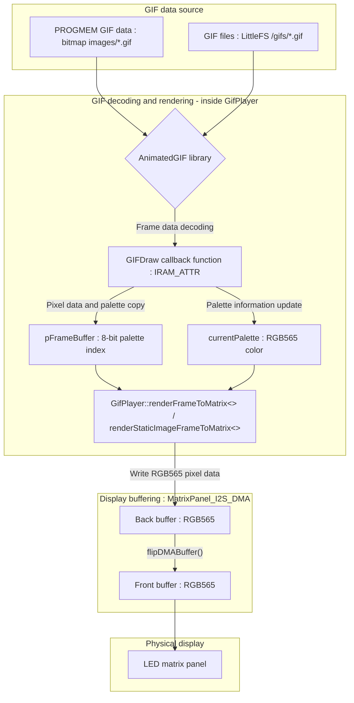
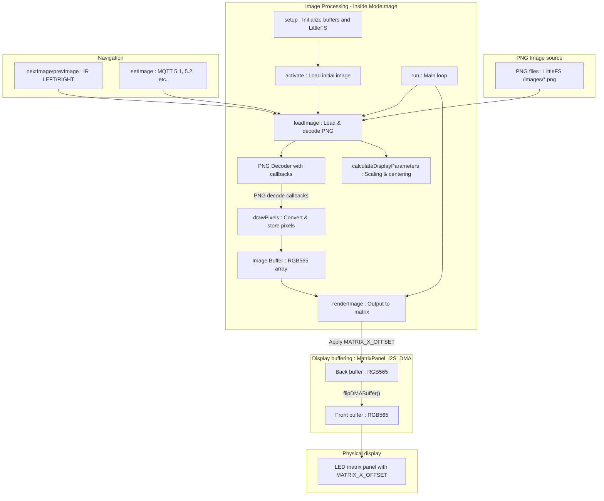
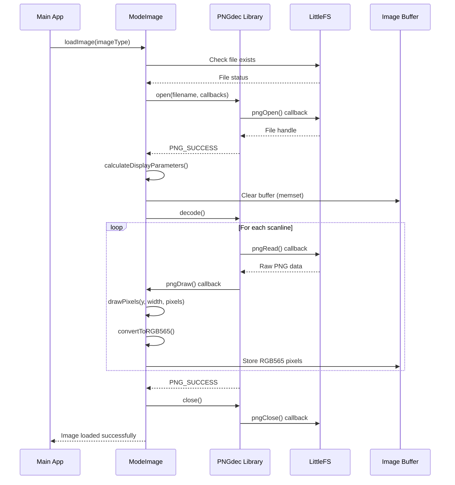
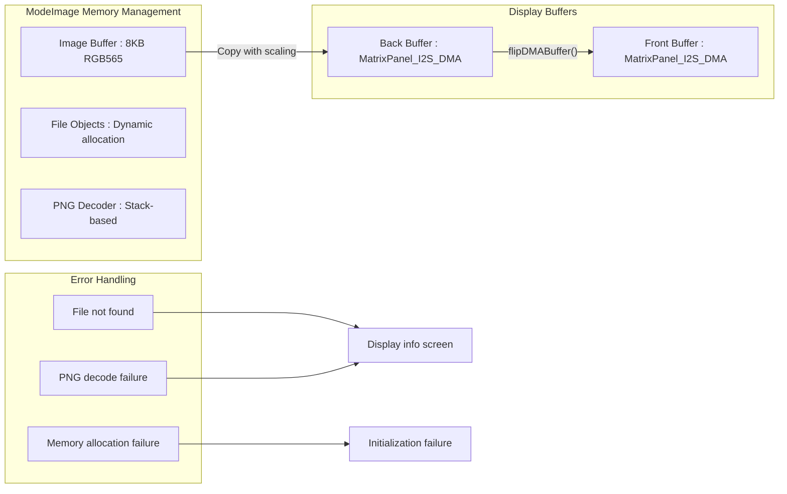
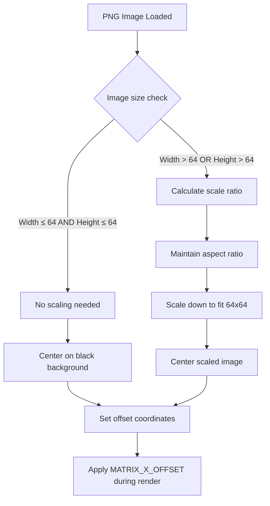
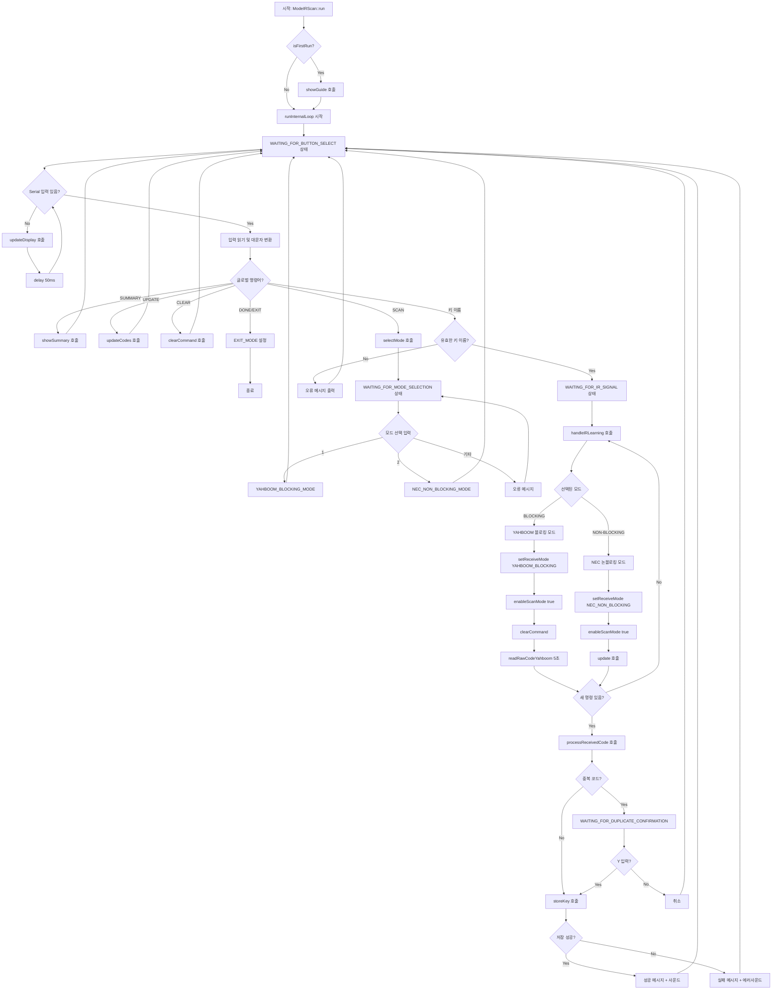
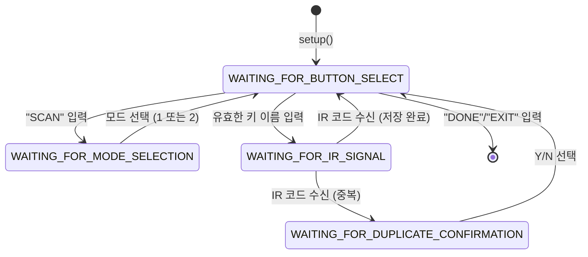
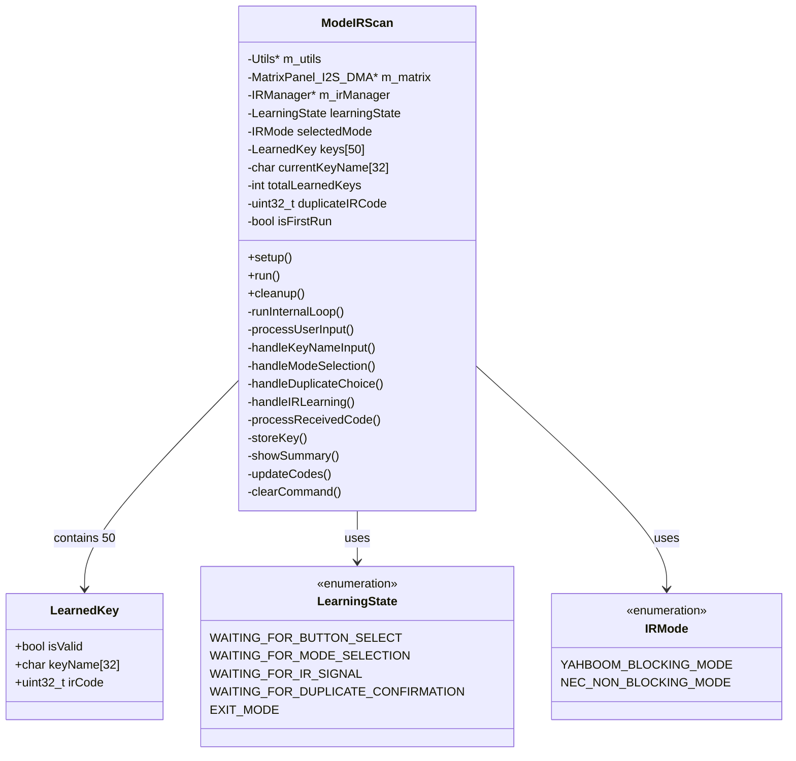

# Notes Somethings for this project

## For Copilot

- 질문 및 답변과 관련된 기본 수칙을 정의합니다.
- 코드블럭안은 주석 포함하여 영문으로, 설명과 답변은 한글로 부탁드립니다.
- 코드에 대한 추천 및 개선사항은 블럭 단위로 제시한 후 대기합니다.
- 모든 코드는 검토한 후 수동으로 반영여부를 개발자가 결정합니다.
- 임의대로 코드를 반영하지 않습니다.

## For Developer


## Timeout configuration for Global Idle and MQTT Mode

### Inactive change to clock mode

- GLOBAL_IDLE_TIMEOUT_MS :사용자 입력이 없을 경우 기본 모드(modeClock)로 전환되는 시간. 현재 5분으로 설정되어 있음
- 사용자 입력은 lastUserActivityTime 변수에 저장되며, mqtt메시지 수신을 포함하는 외부입력(MQTT Message, UP/DOWN Internal Button and IR Command et.)을 기준으로 함

### Inactive change tostandbyMQTT

- IDLE_TIMEOUT_MQTT : MQTT모드(modeMqtt) 또는 다른 모드 사용중 mqtt 메시지를 수신한 후 추가적인 메시지가 수신되지 않는 경우 MQTT 대기화면(standbyMQTT)으로 전환되는 시간. 현재 30초로 설정되어 있음
- standbyMQTT : MQTT모드(2번)의 기본 대기화면. MQTT구독명을 기준으로 한 스테이션 ID값(deviceNo)을 표출
- MQTT 모드에서 메시지를 수신한 후 추가적인 메시지가 수신되지 않는 경우 대기화면으로 전환
- MQTT 대기화면에서 MQTT메시지를 수신하는 경우 메시지 출력화면으로 전환
- 또는 다른 모드에서라도 MQTT 메시지를 수신한 경우, 대기화면을 거치지 않고 바로 MQTT 메시지 출력화면 출력 (내부적으로는 MQTT 모드로 전환)
- 관련 변수 및 설정은 다음과 같습니다:

```cpp
// at main.cpp
unsigned long lastMqttActivity = 0;         // Last MQTT activity time
unsigned long lastUserActivityTime = 0;   

// config.h
// Idle timeout settings for MQTT activity
#define IDLE_TIMEOUT_MQTT (30 * 1000UL)     // Idle time in MQTT mode before switching to the standby screen after receiving a message (milliseconds, currently 30 seconds)
// Global idle timeout to switch to default mode (MODE_CLOCK)
#define GLOBAL_IDLE_TIMEOUT_MS (5 * 60 * 1000UL) // Global idle time. If there is no user input for this duration, switch to clock mode (milliseconds, currently 5 minutes)
```

## Animated GIF Handling

### Overview

- Animated GIFs are handled using the `AnimatedGIF` library.
- The library is initialized in the `setup()` function.
- GIFs are displayed using the `displayGIF()` function. 

- The LED matrix is used to display double buffered GIFs, which allows for smoother animations.
- To prevent flickering, the GIF is displayed in a double-buffered manner. (It is important to call back and front buffers correctly.)

### Procedure of rendering GIFs



#### 프로세스 설명

1. pFrameBuffer의 역할:

- pFrameBuffer는 GifPlayer 클래스 내에 할당된 단일 8비트 팔레트 인덱스 버퍼입니다.
- AnimatedGIF 라이브러리가 GIF 프레임을 디코딩할 때, 각 픽셀의 팔레트 인덱스를 이 pFrameBuffer에 씁니다.
- 이 버퍼는 MatrixPanel_I2S_DMA 라이브러리가 내부적으로 사용하는 더블 버퍼(백 버퍼/프론트 버퍼)와는 별개입니다. pFrameBuffer는 디스플레이로 전송되기 전의 중간 저장소 역할을 합니다.

2. AnimatedGIF 라이브러리:

- GIF 파일(LittleFS 또는 PROGMEM)에서 압축된 데이터를 읽어와 LZW 디코딩을 수행합니다.
- 각 프레임의 픽셀 데이터를 라인 단위로 GIFDraw 콜백 함수에 전달합니다.

3. GIFDraw 콜백 함수 (IRAM_ATTR):

- AnimatedGIF 라이브러리가 프레임의 각 라인을 디코딩할 때마다 호출됩니다. IRAM_ATTR 속성은 이 함수가  RAM에 상주하여 빠르게 실행되도록 합니다.
- 이 함수는 pDraw 구조체를 통해 현재 라인의 픽셀 데이터(8비트 팔레트 인덱스)와 해당 프레임의 팔레트 정보(pDraw->pPalette)를 받습니다.
- GIFDraw는 받은 픽셀 데이터를 GifPlayer의 pFrameBuffer에 복사하고, 팔레트 정보는 currentPalette 배열에 업데이트합니다.
- 정적 이미지 처리: 특히, 파일 시스템 기반의 GIF 중 배경 레이어(투명도가 없는 전체 화면 레이어)는 중복 렌더링을 피하기 위해 건너뛸 수 있습니다. 이는 AnimatedGIF 라이브러리의 특정 동작으로 인해 발생할 수 있는 시각적 아티팩트를 방지합니다.

4. GifPlayer::renderFrameToMatrix() / renderStaticImageFrameToMatrix():

- 이 함수들은 pFrameBuffer에 저장된 8비트 팔레트 인덱스 픽셀 데이터를 읽어옵니다.
- currentPalette 배열을 사용하여 각 픽셀의 팔레트 인덱스를 실제 RGB565 색상 값으로 변환합니다.
- 변환된 RGB565 픽셀은 MatrixPanel_I2S_DMA 디스플레이의 백 버퍼에 그려집니다.
- renderStaticImageFrameToMatrix()의 특성: isStaticImageDisplayed 플래그가 true일 때 사용되는 특수 렌더링 함수입니다. 정적 이미지의 경우, 화면을 완전히 지운 후 pFrameBuffer의 모든 픽셀을 currentPalette를 사용하여 RGB565로 변환하여 백 버퍼에 그립니다. 이는 정적 이미지에서 발생할 수 있는 투명도 문제나 팔레트 오류(예: AnimatedGIF 라이브러리가 팔레트를 제대로 읽지 못해 모든 색상이 검 black으로 처리되는 경우)를 방지하고, 모든 픽셀이 의도한 색상으로 표시되도록 합니다.

5. MatrixPanel_I2S_DMA (더블 버퍼링):

- 이 라이브러리는 내부적으로 두 개의 프레임 버퍼(프론트 버퍼와 백 버퍼)를 사용합니다.
- GifPlayer::render...() 함수는 항상 현재 백 버퍼에 픽셀을 그립니다.
- m_utils->displayShow(): 이 함수는 내부적으로 m_matrix->flipDMABuffer()를 호출합니다. flipDMABuffer()는 현재 백 버퍼의 내용을 프론트 버퍼로 교체하여, 새로 그려진 프레임이 물리적인 LED 매트릭스에 표시되도록 합니다. 이 과정은 매우 빠르게 이루어져 화면 깜빡임(flickering) 없이 부드러운 전환을 제공합니다.

6. 물리적 LED 매트릭스 패널:

프론트 버퍼의 내용이 최종적으로 LED 매트릭스에 표시됩니다.

#### 초기화 및 출력 상태 관리 (pFrameBuffer와 연계)

1. GifPlayer::begin():

- pFrameBuffer를 할당하고 AnimatedGIF 라이브러리를 초기화합니다.
- AnimatedGIF 라이브러리에 pFrameBuffer를 내부 프레임 버퍼로 설정하여, 디코딩된 픽셀이 이 버퍼에 저장되도록 합니다.
- 이 단계에서는 아직 디스플레이의 버퍼에는 아무것도 그려지지 않습니다.

2. GifPlayer::play():

- GIF 재생을 시작할 때 호출됩니다.
- 디스플레이 초기화: m_matrix->fillScreen(0)을 호출하여 디스플레이의 현재 버퍼(프론트 버퍼)를 완전히 지우고, m_utils->displayShow()를 통해 이를 물리적 디스플레이에 반영합니다. (화면을 깨끗하게 시작)
- 첫 프레임 디코딩: gif.playFrame(false, NULL)을 호출하여 GIF의 첫 프레임을 pFrameBuffer에 디코딩합니다.
- 정적/애니메이션 판단: gif.playFrame()의 반환 값에 따라 GIF가 애니메이션인지(result == 1) 또는 정적 이미지인지(result == 0) 판단하고, isStaticImageDisplayed 플래그를 설정합니다.
- 렌더링: isStaticImageDisplayed 플래그에 따라 renderStaticImageFrameToMatrix() 또는 renderFrameToMatrix()를 호출하여 pFrameBuffer의 내용을 MatrixPanel_I2S_DMA의 백 버퍼에 그립니다.
- 최초 표시: m_utils->displayShow()를 호출하여 백 버퍼의 내용을 프론트 버퍼로 교체하고 물리적 디스플레이에 첫 프레임을 표시합니다.

3. GifPlayer::update():

- isPlaying이 true이고 isStaticImageDisplayed가 false일 때만 실행됩니다. (정적 이미지는 한 번만 표시되므로 update()가 필요 없습니다.)
- 다음 프레임 디코딩: gif.playFrame(false, NULL)을 호출하여 GIF의 다음 프레임을 pFrameBuffer에 디코딩합니다.
- 렌더링: renderFrameToMatrix()를 호출하여 pFrameBuffer의 내용을 MatrixPanel_I2S_DMA의 백 버퍼에 그립니다. 이 함수는 GIFDraw 콜백을 통해 pFrameBuffer에 이미 디코딩된 데이터를 m_matrix의 백 버퍼로 옮기는 역할을 합니다.
- 버퍼 스왑: m_utils->displayShow()를 호출하여 백 버퍼의 내용을 프론트 버퍼로 교체하고 물리적 디스플레이에 다음 프레임을 표시합니다.
- 종료/반복 처리: gif.playFrame()이 0을 반환하면 GIF가 끝에 도달한 것입니다. playMode가 GIF_LOOP이면 gif.reset()을 호출하여 GIF를 처음으로 되돌리고, GIF_ONCE이면 stop()을 호출하여 재생을 완전히 중지합니다.

이러한 과정을 통해 pFrameBuffer는 AnimatedGIF 라이브러리와 MatrixPanel_I2S_DMA 디스플레이 사이의 중요한 중간 버퍼 역할을 하며, 더블 버퍼링 메커니즘을 통해 부드러운 GIF 애니메이션이 구현됩니다.

## mode Image : Static Image Viewer

### 전체 프로세스 흐름



### PNG 디코딩 상세 프로세스



### 주요 함수별 상세 설명

#### 1. setup() 함수

```cpp
void ModeImage::setup(Utils* utils_ptr, MatrixPanel_I2S_DMA* matrix_ptr)
```

목적: 이미지 모드 초기화 프로세스:
- Utils와 MatrixPanel 포인터 저장
- LittleFS 파일시스템 초기화 (이미지 파일 접근용)
- 이미지 버퍼 메모리 할당 (64x64 RGB565 = 8KB)
- static 인스턴스 포인터 설정 (PNG 콜백용)

#### 2. activate() 함수

```cpp
void ModeImage::activate()
```
목적: 모드 활성화 시 초기 이미지 로드 프로세스:
- 현재 이미지(기본값: IMAGE_01_WOOSUL) 로드 시도
- 로드 실패 시 정보 화면 표시

#### 3. run() 함수 (메인 루프)

```cpp
void ModeImage::run()
```
목적: 매 프레임마다 실행되는 메인 로직 프로세스:
- 자동 모드 체크 (일정 시간마다 이미지 자동 전환)
- 이미지 로드 상태에 따라 renderImage() 또는 displayInfo() 호출
- 50ms 딜레이로 CPU 사용량 조절

#### 4. loadImage() 함수 (핵심 함수)

```cpp
void ModeImage::loadImage(const char* imageType)
```
목적: PNG 파일을 로드하고 디코딩 상세 프로세스:
- 파일 경로 생성: /images/파일명.png
- 파일 존재 확인: LittleFS.exists()
- PNG 디코더 초기화: 콜백 함수들과 함께 m_png.open()
- 이미지 정보 추출: 가로/세로 크기
- 디스플레이 매개변수 계산: calculateDisplayParameters()
- 이미지 버퍼 초기화: 메모리 클리어
- PNG 디코딩: m_png.decode() - 이때 pngDraw 콜백 호출됨

#### 5. calculateDisplayParameters() 함수

```cpp
void ModeImage::calculateDisplayParameters(uint16_t width, uint16_t height)
```
목적: 이미지 크기에 따른 스케일링 및 중앙정렬 계산 로직:
- 작은 이미지: 원본 크기로 중앙 배치 (검은 배경)
- 큰 이미지: 종횡비 유지하며 64x64에 맞게 스케일링
- 오프셋 계산으로 중앙 정렬

#### 6. PNG 디코딩 콜백 함수들


**pngOpen() (static)**
```cpp
void pngOpen(const char* filename, pngCallbacks* callbacks)
```
- LittleFS에서 파일 열기
- File 객체를 동적 할당하여 반환

**pngRead() (static)**
```cpp
void pngRead(pngFile* file, uint8_t* buffer, size_t size)
```
- PNG 라이브러리가 파일 데이터를 읽을 때 호출
- File 객체에서 데이터 읽어서 버퍼에 복사

**pngDraw() (static)**
```cpp
void pngDraw(pngFile* file, uint16_t y, uint16_t width, uint8_t* pixels)
```
- PNG 라이브러리가 각 라인을 디코딩할 때마다 호출
- static 인스턴스를 통해 drawPixels() 호출

#### 7. drawPixels() 함수 (핵심 렌더링)

```cpp
void ModeImage::drawPixels(uint16_t y, uint16_t width, uint8_t* pixels)
```
목적: PNG에서 디코딩된 한 라인의 픽셀들을 이미지 버퍼에 저장 프로세스:
- 스케일링 적용: y좌표에 스케일 비율 적용
- 각 픽셀 처리:
- x좌표에도 스케일 적용
- convertToRGB565()로 픽셀 변환
- 이미지 버퍼에 저장

#### 8. convertToRGB565() 함수

```cpp
uint16_t ModeImage::convertToRGB565(uint8_t r, uint8_t g, uint8_t b)
```
목적: 다양한 PNG 픽셀 형식을 RGB565로 변환 지원 형식:
- PNG_PIXEL_TRUECOLOR (RGB 24bit)
- PNG_PIXEL_TRUECOLOR_ALPHA (RGBA 32bit)
- PNG_PIXEL_GRAYSCALE (흑백 8bit)

#### 9. renderImage() 함수

```cpp
void ModeImage::renderImage()
```
목적: 이미지 버퍼의 데이터를 실제 LED 매트릭스에 출력 프로세스:
- 화면 클리어: fillScreen(0)
- 픽셀별 출력:
    - 이미지 버퍼에서 픽셀 읽기
    - MATRIX_X_OFFSET 적용하여 실제 좌표 계산
    - 경계 체크 후 drawPixel() 호출
- 버퍼 플립: flipDMABuffer()

#### 10. 네비게이션 함수들

```cpp
void ModeImage::nextImage()
void ModeImage::prevImage()
```
- MQTT로 직접 이미지 지정 시 사용
- 이미지 이름 유효성 검사 후 loadImage() 호출

#### 11. 정보 표시 함수

```cpp
void ModeImage::displayInfo()
```
목적: 이미지 로드 실패 시 모드 정보 표시
- "IMAGE" 텍스트와 현재 이미지 이름 표시
- calculateTextCenterX()로 중앙 정렬 (이미 MATRIX_X_OFFSET 포함)

#### 메모리 관리

이미지 버퍼: 64x64 x 2바이트 = 8KB 동적 할당
File 객체: PNG 콜백에서 동적 할당/해제
cleanup(): 모든 동적 메모리 해제

#### 에러 처리

파일 없음: 정보 화면 표시
PNG 디코딩 실패: 로그 출력 후 정보 화면
메모리 부족: 초기화 실패 처리
유효하지 않은 이미지 타입: 로그 출력 후 무시

이러한 구조로 PNG 이미지의 안정적인 로드, 스케일링, 표시가 가능합니다.

### Mode Image 프로세스 다이어그램

#### 전체 아키텍처 흐름


#### PNG 디코딩 상세 시퀀스


#### 메모리 및 버퍼 관리



#### 이미지 스케일링 로직



이제 `mode_image`의 전체 프로세스가 mermaid 다이어그램으로 시각화되었습니다.

## USE A MATRIX_X_OFFSET 

drawPixel((x + 1) % MATRIX_WIDTH, y, color) 와 drawPixel(x + MATRIX_WIDTH, y, color) 코드의 차이점을 설명해 드릴게요. drawPixel(X +1, y, color)도 마찬가지로 현재 x 좌표에 1을 더하는 방식입니다. 결국 마지막 픽셀은 화면 끝에 도달하면 화면 밖으로 사라지게 됩니다.

두 코드 모두 drawPixel 함수의 x 좌표 인수에 대한 표현식입니다. 이 두 표현식은 LED 매트릭스에 픽셀을 그릴 때 x 좌표를 계산하는 방식에서 매우 중요한 차이를 가집니다.

### 1. drawPixel((x + 1) % MATRIX_WIDTH, y, color)

* x + 1: 현재 x 좌표에 1을 더합니다. 이는 픽셀을 오른쪽으로 1칸 이동시키는 효과를 줍니다.
* % MATRIX_WIDTH: 이 부분은 모듈로(modulo) 연산자입니다. (x + 1)의 값을 MATRIX_WIDTH로 나눈 나머지를 계산합니다.
 
#### 의미 및 용도: 이 표현식은 주로 "좌표 감싸기(wrap-around)" 효과를 구현하는 데 사용됩니다.

* 만약 x가 MATRIX_WIDTH - 1 (매트릭스의 가장 오른쪽 열)이라면, x + 1은 MATRIX_WIDTH가 됩니다.
* MATRIX_WIDTH % MATRIX_WIDTH의 결과는 0이 됩니다.
* 따라서 픽셀은 매트릭스의 가장 오른쪽 끝을 넘어가면 자동으로 가장 왼쪽 열(인덱스 0)으로 다시 나타나게 됩니다.

#### 예시 (MATRIX_WIDTH = 64일 경우):

* x = 0 일 때: (0 + 1) % 64 = 1
* x = 63 일 때: (63 + 1) % 64 = 64 % 64 = 0 (가장 오른쪽에서 왼쪽 끝으로 이동)
코드 내에서의 역할: 제공된 gif_player.cpp 및 mode_pattern.cpp 파일에서 이 코드는 MATRIX_X_OFFSET (일반적으로 1)과 같은 하드웨어 보정이나 시각적 효과(예: 픽셀을 1칸 오른쪽으로 이동시키면서 화면 밖으로 나가지 않고 반대편에서 다시 나타나게 하는 스크롤링)를 적용하는 데 사용됩니다.

### 2. drawPixel(x + MATRIX_WIDTH, y, color)

* x + MATRIX_WIDTH: 현재 x 좌표에 매트릭스의 전체 너비(MATRIX_WIDTH)를 더합니다.

#### 의미 및 용도: 이 표현식은 x 좌표를 매트릭스의 가시 영역(visible area) 바깥으로 크게 벗어나게 만듭니다.

* 일반적으로 x 좌표는 0부터 MATRIX_WIDTH - 1 사이의 값을 가집니다.
* 여기에 MATRIX_WIDTH를 더하면, 결과 x 좌표는 MATRIX_WIDTH부터 2 * MATRIX_WIDTH - 1 사이의 값이 됩니다.

#### 예시 (MATRIX_WIDTH = 64일 경우):
* x = 0 일 때: 0 + 64 = 64
* x = 63 일 때: 63 + 64 = 127
코드 내에서의 역할: MatrixPanel_I2S_DMA 라이브러리의 drawPixel 함수는 내부적으로 유효한 좌표 범위(0부터 width-1)를 확인하는 경계 검사(bounds checking) 로직을 가지고 있습니다. x + MATRIX_WIDTH의 결과는 항상 이 유효 범위를 벗어나므로, 이 픽셀은 화면에 그려지지 않습니다.

이러한 코드는 다음과 같은 경우에 사용될 수 있습니다:

* 디버깅 목적: 특정 픽셀이 그려지는지 확인하기 위해 임시로 사용될 수 있습니다.
* 오류 또는 미완성 코드: 의도치 않게 잘못 작성되었거나, 아직 구현되지 않은 기능의 흔적일 수 있습니다.
* 다중 패널 시스템: 여러 개의 매트릭스 패널이 연결된 더 큰 가상 디스플레이에서, 특정 패널의 범위를 넘어선 좌표를 계산하는 데 사용될 수도 있지만, 단일 패트릭스에서는 픽셀이 그려지지 않습니다.
핵심 차이점 요약

|특징  |	(x + 1) % MATRIX_WIDTH	| x + MATRIX_WIDTH |
|-----|-------------------|---------------------|
| 목적 |픽셀을 1칸 이동시키고, 화면 끝에서 반대편으로 감싸기(wrap-around)|	픽셀을 화면 유효 범위 밖으로 이동시킴 |
| 결과 |픽셀이 화면 내에서 이동하며, 끝에 도달하면 반대편에서 다시 나타남	|픽셀이 화면에 그려지지 않음 (경계 검사에 의해 필터링됨)|
| 주요 용도 |스크롤링, 애니메이션, 하드웨어 좌표 보정 등	|디버깅, 오류, 또는 다중 패널 시스템의 특정 좌표 계산 (단일 패널에서는 무의미)|

 결론적으로, (x + 1) % MATRIX_WIDTH는 의도적인 시각적 효과나 좌표 보정을 위해 사용되는 반면, x + MATRIX_WIDTH는 단일 매트릭스에서는 픽셀을 그리지 않는 코드입니다.

## modeImage에서 큰이미지를 MATRIX 사이즈에 맞게 출력하는 방법

LED 매트릭스(64x64)보다 큰 이미지를 표시할 때, 종횡비를 유지하면서 매트릭스 크기에 맞춰 이미지를 축소하여 출력하도록 mode_image.cpp 파일을 수정했습니다.

기존 코드에서는 이미지가 매트릭스보다 클 경우 단순히 잘라내어 표시했지만, 이제는 이미지의 가로세로 비율을 유지하면서 매트릭스에 딱 맞게 축소하여 표시합니다. 이를 위해 PNG 디코딩 라이브러리(PNGdec)의 기능을 활용하여 이미지를 임시 버퍼에 원본 크기로 디코딩한 후, 원하는 크기(64x64)로 리샘플링하여 최종 이미지 버퍼에 저장하는 방식을 사용합니다.

**이미지 크기를 변경하는 주요 함수:**

### ModeImage::calculateDisplayParameters():

* 원본 이미지의 크기와 매트릭스 크기를 비교하여 적절한 스케일링 비율(m_scaleX, m_scaleY)을 계산합니다.
* 계산된 스케일링 비율을 바탕으로 화면에 표시될 이미지의 실제 너비(m_displayWidth)와 높이(m_displayHeight)를 결정하고, 중앙 정렬을 위한 오프셋(m_offsetX, m_offsetY)을 계산합니다.

```cpp
void ModeImage::calculateDisplayParameters() {
    // Determine scaling factor
    float scaleX = (float)MATRIX_WIDTH / m_imageWidth;
    float scaleY = (float)MATRIX_HEIGHT / m_imageHeight;
    
    if (m_imageWidth <= MATRIX_WIDTH && m_imageHeight <= MATRIX_HEIGHT) {
        // Image fits within matrix, no scaling needed
        m_scaleX = 1.0f;
        m_scaleY = 1.0f;
    } else {
        // Image is larger than matrix in at least one dimension, scale down
        m_scaleX = std::min(scaleX, scaleY);
        m_scaleY = m_scaleX; // Maintain aspect ratio
    }
    
    m_displayWidth = (int)(m_imageWidth * m_scaleX);
    m_displayHeight = (int)(m_imageHeight * m_scaleY);
    
    // Calculate offsets for centering the scaled image
    m_offsetX = (MATRIX_WIDTH - m_displayWidth) / 2;
    m_offsetY = (MATRIX_HEIGHT - m_displayHeight) / 2;
    
    // MATRIX_X_OFFSET is always applied during rendering, not here.
    // m_useMatrixXOffset flag is for conditional application of MATRIX_X_OFFSET in renderImage.
    // It's generally true for hardware correction.
    m_useMatrixXOffset = true; 
}
```
### ModeImage::loadImage():

* PNG 파일을 열어 원본 이미지의 너비와 높이를 가져옵니다.
* calculateDisplayParameters()를 호출하여 스케일링 정보를 설정합니다.
* 스케일링이 필요한 경우 (이미지가 매트릭스보다 큰 경우):
  * 원본 이미지의 모든 픽셀 데이터를 저장할 임시 버퍼(tempRawBuffer)를 할당합니다. 이때 PSRAM을 우선적으로 사용하고, 실패 시 일반 RAM으로 폴백합니다.
  * m_png.setBuffer(tempRawBuffer)를 호출하여 PNG 디코더가 이 임시 버퍼에 직접 디코딩하도록 지시합니다.
  * 디코딩이 완료되면, tempRawBuffer에서 픽셀을 읽어와 m_scaleX, m_scaleY 비율에 맞춰 최종 이미지 버퍼(m_imageBuffer)에 리샘플링하여 저장합니다.
  * 리샘플링 시 getPixelColor() 헬퍼 함수를 사용하여 다양한 픽셀 형식(그레이스케일, 트루컬러, 알파 채널, 인덱스 팔레트)을 RGB565로 변환합니다.
  * 임시 버퍼는 사용 후 해제합니다.
* 스케일링이 필요 없는 경우 (이미지가 매트릭스에 맞는 경우):
  * m_png.setBuffer(nullptr)를 호출하여 PNG 디코더가 pngDraw 콜백 함수를 통해 라인별로 디코딩하도록 합니다.
  * pngDraw 콜백은 drawPixels()를 호출하여 디코딩된 라인을 최종 이미지 버퍼(m_imageBuffer)에 직접 복사합니다.

### ModeImage::drawPixels():

* 이 함수는 스케일링이 필요 없는 경우(loadImage에서 m_png.setBuffer(nullptr)를 호출한 경우)에만 PNGdec 라이브러리에 의해 라인별로 호출됩니다.
* 디코딩된 픽셀 라인을 m_imageBuffer에 적절한 오프셋(m_offsetX, m_offsetY)을 적용하여 복사합니다.
* 다양한 PNG 픽셀 형식을 RGB565로 변환하는 로직을 포함합니다.

### ModeImage::getPixelColor() (새로운 헬퍼 함수):

* 주어진 원본 rawBuffer에서 특정 (x, y) 좌표의 픽셀을 읽어와 RGB565 색상으로 변환하는 역할을 합니다.
* PNG_PIXEL_INDEXED 형식의 경우 m_png.getPalette()를 통해 팔레트 정보를 참조합니다.

### ModeImage::convertToRGB565():

더 이상 사용되지 않으므로 제거되었습니다.
이 변경 사항을 통해 mode_image는 다양한 크기의 PNG 이미지를 매트릭스에 최적화된 방식으로 표시할 수 있게 됩니다.

## IR SCAN

### IR SCAN 기능 개요

### IR SCAN Process

#### IR Scan Mode Process Diagram


graph TD
    A[시작: ModeIRScan::run] --> B{isFirstRun?}
    B -->|Yes| C[showGuide 호출]
    B -->|No| D[runInternalLoop 시작]
    C --> D
    
    D --> E[WAITING_FOR_BUTTON_SELECT 상태]
    E --> F{Serial 입력 있음?}
    F -->|No| G[updateDisplay 호출]
    G --> H[delay 50ms]
    H --> F
    
    F -->|Yes| I[입력 읽기 및 대문자 변환]
    I --> J{글로벌 명령어?}
    
    J -->|SUMMARY| K[showSummary 호출]
    J -->|UPDATE| L[updateCodes 호출]
    J -->|CLEAR| M[clearCommand 호출]
    J -->|DONE/EXIT| N[EXIT_MODE 설정]
    J -->|SCAN| O[selectMode 호출]
    
    K --> E
    L --> E
    M --> E
    N --> Z[종료]
    
    O --> P[WAITING_FOR_MODE_SELECTION 상태]
    P --> Q{모드 선택 입력}
    Q -->|1| R[YAHBOOM_BLOCKING_MODE]
    Q -->|2| S[NEC_NON_BLOCKING_MODE]
    Q -->|기타| T[오류 메시지]
    
    R --> E
    S --> E
    T --> P
    
    J -->|키 이름| U{유효한 키 이름?}
    U -->|No| V[오류 메시지 출력]
    U -->|Yes| W[WAITING_FOR_IR_SIGNAL 상태]
    V --> E
    
    W --> X[handleIRLearning 호출]
    X --> Y{선택된 모드}
    
    Y -->|BLOCKING| AA[YAHBOOM 블로킹 모드]
    Y -->|NON-BLOCKING| BB[NEC 논블로킹 모드]
    
    AA --> CC[setReceiveMode YAHBOOM_BLOCKING]
    CC --> DD[enableScanMode true]
    DD --> EE[clearCommand]
    EE --> FF[readRawCodeYahboom 5초]
    FF --> GG{새 명령 있음?}
    
    BB --> HH[setReceiveMode NEC_NON_BLOCKING]
    HH --> II[enableScanMode true]
    II --> JJ[update 호출]
    JJ --> GG
    
    GG -->|No| X
    GG -->|Yes| KK[processReceivedCode 호출]
    
    KK --> LL{중복 코드?}
    LL -->|Yes| MM[WAITING_FOR_DUPLICATE_CONFIRMATION]
    LL -->|No| NN[storeKey 호출]
    
    MM --> OO{Y 입력?}
    OO -->|Yes| NN
    OO -->|No| PP[취소]
    
    NN --> QQ{저장 성공?}
    QQ -->|Yes| RR[성공 메시지 + 사운드]
    QQ -->|No| SS[실패 메시지 + 에러사운드]
    
    PP --> E
    RR --> E
    SS --> E
```

#### 핵심 프로세스 설명

핵심 프로세스 설명
1. 초기화 단계
setup(): 포인터 설정, 상태 초기화, 키 배열 클리어
run(): 첫 실행 시 가이드 표시, 내부 루프 시작
2. 메인 루프 (runInternalLoop)
입력 처리: 시리얼 입력 읽기 및 명령 분석
상태별 처리: 현재 상태에 따른 로직 실행
IR 학습: IR 신호 대기 상태에서 코드 수신
디스플레이 업데이트: 1초마다 화면 갱신
3. IR 학습 프로세스
4. 명령어 체계
SCAN: 모드 선택 후 학습 시작
SUMMARY: 학습된 키 목록 표시
UPDATE: IRManager에 코드 등록
CLEAR: 명령 플래그 클리어
키이름: 직접 IR 학습 시작
5. 두 가지 IR 모드
YAHBOOM_BLOCKING: 블로킹 방식, 5초 타임아웃
NEC_NON_BLOCKING: 논블로킹 방식, 지속적 업데이트
6. 에러 처리
키 이름 검증 (알파벳 시작, 영숫자+언더스코어)
중복 코드 처리 (덮어쓰기 확인)
저장 공간 부족 처리 (최대 50개)


#### 상태 전환 다이어그램



#### 클래스 구조 다이어그램



